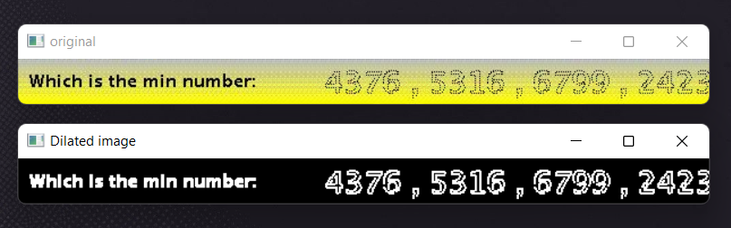

# Captcha OCR API
Python flask API that resolve base64 captcha image. This project uses Google [Vision AI](https://cloud.google.com/vision) API for OCR processing.


## Prerequisite

- Python3
- Flask
- [OpenCV](https://docs.opencv.org/4.x/d6/d00/tutorial_py_root.html)
- Google APIs

## Installation
1. Clone this repository to your workspace
```shell
git clone https://github.com/parth-p-7span/captcha-visionAI-api.git
```
2. Navigate to captcha-visionAI-api folder in your Terminal/CMD
```shell
cd captcha-visionAI-api
```
3. Now install the required libraries using following command
```shell
pip install -r requirements.txt
```
4. Create `.env` file in the root directory of the project and set your [Vision AI](https://cloud.google.com/vision) API token with `TOKEN` key
5. Run the project using following command
```shell
python app.py
```

## Usage


## Logic
- Decode base64 string to numpy array
- Convert numpy array to opencv image
- Process image in opencv to connect dots of characters to get the better outcome
- Send processed image to Google VisionAI API for OCR process
- Difference between original image and opencv processed image

